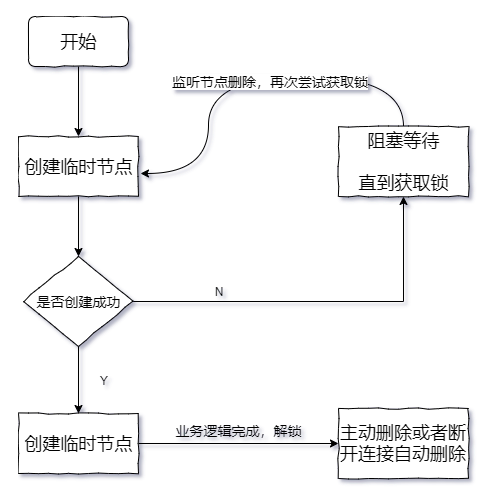
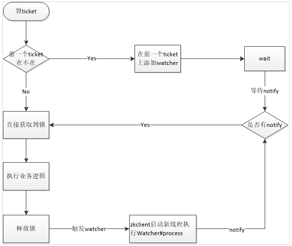

## 分布式锁实现
定义：为什么使用锁？锁的出现是为了解决资源争用问题，在单线程环境下的资源争夺可以使用JDK里的锁实现，
分布式锁是为了解决分布式环境下的资源争用问题。

### 基于zookeeper实现
#### 1.排它锁
简介：排他锁(Exclusive Locks，简称X锁)，又称为写锁或独占锁，是一种基本的锁类型。
如果事务 T1对数据对象 O1加上了排他锁，那么在整个加锁期间，只允许事务 T1对 O1进行读取和更新操作，其他任何事务都不能再对这个数据对象进行任何类型的操作——直到T1释放了排他锁。（相当于悲观锁）

实现：
（1）定义锁：<BR>
zookeeper上的节点来表示一个锁，例如/exclusive_lock/lock节点就可以被定义为一个锁
注意：这里需要创建的是临时节点，是为了避免死锁，当服务宕机会话关闭临时节点将会被删除，锁自动释放

（2）获取锁：<BR>
在需要获取锁时，所有的客户端都会试图通过调用 create()接口，在/exclusive_lock节点下创建临时子节点/exclusive_lock/lock。在前⾯，我们也介绍了，
ZooKeeper 会保证在所有的客户端中，最终只有⼀个客户端能够创建成功，那么就可以认为该客户端获取了锁。
同时，所有没有获取到锁的客户端就需要到/exclusive_lock 节点上注册⼀个子节点变更的Watcher监听，以便实时监听到lock节点的变更情况。
+ 1）尝试获取锁，尝试创建临时节点，zk会保证只有一个客户端创建成功
+ 2）如果创建节点成功则获取锁成功，继续执行业务逻辑
+ 3）如果创建节点失败，节点已经被其他客户端创建，则获取锁失败，监听该节点的删除事件，这期间线程出于阻塞等待状态
+ 4）第2步的线程执行完业务逻辑，释放锁，即删除节点，监听该节点的线程会收到通知，退出等待，可以再次尝试获取锁，递归第1步，递归：获取锁的过程是一个递归的操作，获取锁->监听->获取锁

（3）释放锁：<BR>
有两种情况可以释放锁：
1. 当前获取锁的客户端机器发生宕机，那么ZooKeeper上的这个临时节点就会被移除。
2. 正常执行完业务逻辑后，客户端就会主动将⾃⼰创建的临时节点删除。 无论在什么情况下移除了lock节点，
ZooKeeper都会通知所有在/exclusive_lock节点上注册了子节点变更Watcher监听的客户端。这些客户端在接收到通知后，再次重新发起分布式锁获取，即重复“获取锁”过程。

实现参考类：cn.yao.lock.zk.mutex.ZkLockMutex

优缺点：
优点：实现简单
缺点：
+ 不可重入，所谓的重入是递归获取锁，当已经持有锁时再尝试获取锁时，不可重入锁会产生死锁等待
+ 有羊群效应，当释放锁的时候会把其他所有机器全部唤醒，但是最终只有一台机器会抢到锁，没有抢到的还得继续休眠。
+ 非公平锁，每次都需要重新排队，而不是按FIFO队列获取锁



#### 2. 排他锁升级
优化目的：解决羊群效应，同时保证公平锁

实现原理：区别是创建的临时顺序节点，每一个客户端在争夺锁时都会由zk分配一个顺序号(sequence)，客户端按照这个顺序去获取锁
```
basePath/
    ├──lock-0000000000（由client1创建，由于序号最小，所以获取到锁）
    ├──lock-0000000001（由client2创建，并监听lock-0000000000的变化）
    └──lock-0000000002（由client3创建，并监听lock-0000000001的变化）
```

具体流程：
+ 获取锁：
（1）客户端尝试获取锁，客户端创建临时顺序节点/distribute-lock2/lock-，返回/distribute-lock2/lock-0000000001
（2）拿到sequence，获取节点/distribute-lock2下所有子节点，并排序
（3）如果没有比自己小的节点，则获取锁成功
（4）如果存在比自己小的节点，则监听上一个比自己小的节点的删除事件，监听期间，线程等待，一旦监听到上一个节点被删除，线程被唤醒，再次尝试获取锁(直接拿到锁即可)
    
+ 释放锁： 同其他逻辑一样，删除当前节点即可

参考实现类：cn.yao.lock.zk.mutex.ZkLockMutexUpgrade



#### 可重入排它锁
#### 读写锁

#### 开源实现-Curator分布式锁工具
Curator实现了可重入锁(InterProcessMutex),也实现了不可重入锁(InterProcessSemaphoreMutex)。在可重入锁中还实现了读写锁
代码示例：
```
//通过下面一段代码实现可重入锁
InterProcessMutex lock = new InterProcessMutex(client, lockPath);
try {
    lock.acquire();
    //doSomething 业务员逻辑
} finally{
    lock.release();
}
```


### 基于redis实现分布式锁


### 总结
+ 实现方式不同：redis实现为去插入一条占位数据，而zk实现为注册一个临时节点
+ 遇到宕机情况下，redis需要等到过期时间到了后自动释放锁，而ZK因为是临时节点，在宕机时候已经是删除了节点去释放锁
+ redis在没抢到锁的情况下一般会去自旋获取锁，比较浪费性能，而ZK是通过注册监听的方式获取锁，性能而言优于Redis